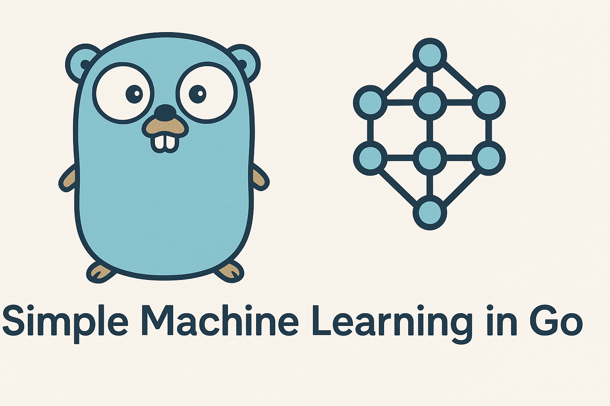

# GOML - Machine Learning in Go

<p align="center">
  
</p>

GOML is a simple yet powerful machine learning package in Go that supports training and inference with multiple input/output parameters using generic types. It's designed to be easy to use while providing flexible model serialization and configuration options.

## Use Cases

GOML is ideal for a wide range of machine learning applications:

- **Fraud Detection**: Build models that analyze transaction patterns and flag suspicious activities by combining numerical features (transaction amount, frequency) with categorical data (location, merchant type).

- **Financial Analytics**: Predict market trends, stock prices, and investment outcomes using both quantitative metrics and qualitative factors.

- **User Behavior Prediction**: Forecast user actions on websites or apps by analyzing a mix of behavioral data (time spent, clicks) and user attributes (demographics, preferences).

- **IoT Data Processing**: Process sensor data with varied types (temperature, status indicators, categorical states) to predict system behavior or failures.

- **Customer Analytics**: Create personalized recommendation systems by combining purchase history, demographic information, and preference data.

- **Healthcare Monitoring**: Analyze patient data to predict health outcomes or detect anomalies using vital signs, test results, and treatment categories.

- **Resource Allocation**: Optimize resource distribution in systems by predicting demands based on historical usage patterns and categorical variables.

Built with Go's performance and simplicity in mind, GOML makes it easy to integrate machine learning capabilities into your Go applications without the complexity of large ML frameworks.

## Features

- Support for multiple input and output parameters
- Support for various data types (numeric, string, boolean) for both inputs and outputs
- Serialization of models and weights to JSON for persistence
- Flexible training configuration
- Support for four specialized model types:
  - Linear regression (numeric outputs - both int and float)
  - Logistic regression (binary classification with boolean or 0/1 outputs)
  - Categorical classification (string/categorical outputs)
  - Mixed model (handles any combination of numeric, boolean, and string outputs)
- Automatic model type detection based on output data
- Ability to save and restore trained models
- Support for mixed input types (numeric, string, boolean) with all model types
- Comprehensive type conversion and handling

## Installation

```bash
go get github.com/audi70r/goml
```

## Quick Start

```go
package main

import (
    "fmt"
    "github.com/audi70r/goml/pkg/goml"
)

func main() {
    // Create and train a model in one step with automatic model selection
    inputs := []map[string]interface{}{
        {"feature1": 1.0, "feature2": 2.0},
        {"feature1": 2.0, "feature2": 3.0},
        {"feature1": 3.0, "feature2": 4.0},
    }
    
    outputs := []map[string]interface{}{
        {"result": 5.0},
        {"result": 8.0},
        {"result": 11.0},
    }
    
    // Auto-detect model type and train
    engine, err := goml.TrainAuto(inputs, outputs)
    if err != nil {
        fmt.Printf("Training error: %v\n", err)
        return
    }
    
    // Make a prediction
    prediction, err := engine.Predict(map[string]interface{}{
        "feature1": 4.0,
        "feature2": 5.0,
    })
    
    if err != nil {
        fmt.Printf("Prediction error: %v\n", err)
        return
    }
    
    fmt.Println("Prediction:", prediction)
}
```

## Usage Examples

### Linear Regression Example

```go
// Create a new ML engine with a linear model
engine := goml.New()
model := goml.NewLinearModel()
engine.WithModel(model.JSON())

// Configure training
config := &goml.Config{
    LearningRate: 0.01,
    Epochs:       1000,
    BatchSize:    32,
    Regularize:   0.0001,
    Tolerance:    0.00001,
}
engine.WithConfig(config)

// Prepare training data
inputs := []map[string]interface{}{
    {"size": 1000, "bedrooms": 2, "location": "suburban"},
    {"size": 1500, "bedrooms": 3, "location": "suburban"},
    {"size": 800, "bedrooms": 1, "location": "urban"},
    {"size": 2000, "bedrooms": 4, "location": "rural"},
}

outputs := []map[string]interface{}{
    {"price": 200000, "rental": 1500},
    {"price": 300000, "rental": 2100},
    {"price": 220000, "rental": 1700},
    {"price": 350000, "rental": 2400},
}

// Train the model
err := engine.Train(inputs, outputs)
if err != nil {
    fmt.Printf("Training error: %v\n", err)
    return
}

// Make a prediction
newHouse := map[string]interface{}{
    "size":     1300,
    "bedrooms": 2,
    "location": "suburban",
}

prediction, err := engine.Predict(newHouse)
if err != nil {
    fmt.Printf("Prediction error: %v\n", err)
    return
}

fmt.Println("Prediction:", prediction)

// Save the model and weights
modelJSON, _ := engine.GetModel()
weightsJSON, _ := engine.GetWeights()

// Later, restore the model
newEngine := goml.New()
newEngine.WithModel(*modelJSON)
newEngine.WithWeights(*weightsJSON)
```

### Logistic Regression Example (Binary Classification)

```go
// Create a logistic regression model
logisticModel := goml.NewLogisticModel()
logisticEngine := goml.New()
logisticEngine.WithModel(logisticModel.JSON())
logisticEngine.WithConfig(&goml.Config{
    LearningRate: 0.01,
    Epochs:       1000,
})

// Train for binary classification
// Works with both numeric (0/1) and boolean (true/false) outputs
inputs := []map[string]interface{}{
    {"study_hours": 8, "prev_grade": 85},
    {"study_hours": 3, "prev_grade": 60},
    {"study_hours": 5, "prev_grade": 70},
    {"study_hours": 10, "prev_grade": 90},
}
outputs := []map[string]interface{}{
    {"pass": true},   // or {"pass": 1}
    {"pass": false},  // or {"pass": 0}
    {"pass": false},  // or {"pass": 0}
    {"pass": true},   // or {"pass": 1}
}

logisticEngine.Train(inputs, outputs)

// Get prediction (will be boolean or probability between 0 and 1)
prediction, _ := logisticEngine.Predict(map[string]interface{}{
    "study_hours": 6,
    "prev_grade": 75,
})

fmt.Println("Prediction:", prediction)
// Will return {"pass": true} or {"pass": 0.73} (probability)
```

### Categorical Classification Example (String Outputs)

```go
// Create a categorical model for string outputs
categoricalModel := goml.NewCategoricalModel()
categoricalEngine := goml.New()
categoricalEngine.WithModel(categoricalModel.JSON())
categoricalEngine.WithConfig(&goml.Config{
    LearningRate: 0.01,
    Epochs:       1000,
})

// Example: Predict car type based on features
inputs := []map[string]interface{}{
    {"engine_size": 2.0, "doors": 4, "weight": 1500},
    {"engine_size": 3.0, "doors": 2, "weight": 1800}, 
    {"engine_size": 1.6, "doors": 4, "weight": 1200},
}

// String output values
outputs := []map[string]interface{}{
    {"car_type": "sedan"},
    {"car_type": "sports"},
    {"car_type": "compact"},
}

categoricalEngine.Train(inputs, outputs)

// Predict the car type (returns string value)
prediction, _ := categoricalEngine.Predict(map[string]interface{}{
    "engine_size": 2.5,
    "doors": 4,
    "weight": 1700,
})

fmt.Println("Prediction:", prediction)
// Will return {"car_type": "sedan", "car_type_probs": {"sedan": 0.7, "sports": 0.2, "compact": 0.1}}
```

### Multiple Categorical Outputs Example

```go
// Create model for multiple categorical outputs
multiCatModel := goml.NewCategoricalModel()
multiCatEngine := goml.New()
multiCatEngine.WithModel(multiCatModel.JSON())

// Training data with multiple string outputs
inputs := []map[string]interface{}{
    {"engine_size": 2.0, "doors": 4, "weight": 1500},
    {"engine_size": 3.0, "doors": 2, "weight": 1800},
}
outputs := []map[string]interface{}{
    {"car_type": "sedan", "color": "blue"},
    {"car_type": "sports", "color": "red"},
}

// Train the model
multiCatEngine.Train(inputs, outputs)

// Predict multiple string outputs
prediction, _ := multiCatEngine.Predict(map[string]interface{}{
    "engine_size": 2.5,
    "doors": 3,
    "weight": 1650,
})

fmt.Println("Prediction:", prediction)
// Result will contain both predicted categories:
// {"car_type": "sedan", "color": "blue"}
```

### Handling Mixed Input Types

GOML supports all input types (numeric, string, boolean) with all model types:

```go
// All model types support mixed input types
model := goml.NewLinearModel() // or NewCategoricalModel() or NewLogisticModel()
engine := goml.New()
engine.WithModel(model.JSON())

// Training data with mixed input types (numeric, boolean, string)
inputs := []map[string]interface{}{
    {"numeric_feature": 1.5, "category": "red", "bool_feature": true},
    {"numeric_feature": 2.5, "category": "blue", "bool_feature": false},
}

// Outputs matching the model type (numeric for linear, string for categorical)
outputs := []map[string]interface{}{
    {"price": 199.99},
    {"price": 299.99},
}

// Train the model
engine.Train(inputs, outputs)

// Predict with the same mixed input types
prediction, _ := engine.Predict(map[string]interface{}{
    "numeric_feature": 2.0,
    "category": "red",
    "bool_feature": true,
})

fmt.Println("Prediction:", prediction)
// For linear model: {"price": 249.99}
// For categorical: {"category": "standard"}
```

### Boolean Input/Output Support

GOML fully supports boolean values for both inputs and outputs:

```go
// Example: Predict product availability based on features
inputs := []map[string]interface{}{
    {"is_popular": true, "is_seasonal": false, "has_discount": true},
    {"is_popular": false, "is_seasonal": true, "has_discount": false},
    {"is_popular": true, "is_seasonal": true, "has_discount": false},
    {"is_popular": false, "is_seasonal": false, "has_discount": true},
}

outputs := []map[string]interface{}{
    {"in_stock": true},
    {"in_stock": false},
    {"in_stock": true},
    {"in_stock": false},
}

// Train with boolean inputs/outputs
engine, err := goml.TrainAuto(inputs, outputs)
if err != nil {
    fmt.Printf("Boolean training error: %v\n", err)
}

// Make prediction with boolean input
prediction, _ := engine.Predict(map[string]interface{}{
    "is_popular": true,
    "is_seasonal": false,
    "has_discount": false,
})

fmt.Println("Boolean prediction:", prediction)
// Will return: {"in_stock": true}
```

### Automatic Model Selection

GOML can automatically select the right model type based on your output data:

```go
// Create engine with automatic model detection
outputSample := map[string]interface{}{"price": 100.0, "quantity": 5}
engine := goml.NewAuto(outputSample)

// Or use the one-step approach
engine, err := goml.TrainAuto(inputs, outputs)
```

The auto-detection follows these rules:

1. If outputs contain a mix of data types (string, numeric, boolean) → Mixed model
2. If any output value is a string (and no other types) → Categorical model
3. If all values are 0/1 or boolean → Logistic model
4. For any other numeric outputs → Linear model

Examples:

```go
// Automatic detection of numeric data (linear model)
numericOutputs := map[string]interface{}{
    "price": 100.0,
    "quantity": 5,
}
autoEngine := goml.NewAuto(numericOutputs)
// Result: Linear model

// Automatic detection of string data (categorical model)
stringOutputs := map[string]interface{}{
    "category": "electronics",
    "color": "red",
}
autoEngine := goml.NewAuto(stringOutputs)
// Result: Categorical model

// Automatic detection of binary data (logistic model)
binaryOutputs := map[string]interface{}{
    "pass": 1,
    "qualified": 0,
}
autoEngine := goml.NewAuto(binaryOutputs)
// Result: Logistic model

// Automatic detection of boolean outputs (logistic model)
boolOutputs := map[string]interface{}{
    "is_premium": true,
    "in_stock": false,
}
autoBoolEngine := goml.NewAuto(boolOutputs)
// Result: Logistic model

// Automatic detection of mixed output types
mixedOutputs := map[string]interface{}{
    "category": "electronics",  // string output
    "price": 100.0,             // numeric output
    "in_stock": true            // boolean output
}
autoMixedEngine := goml.NewAuto(mixedOutputs)
// Result: Mixed model
```

### Working with Multiple Output Types

To handle both numeric and string outputs, use separate models:

```go
// For numeric outputs
numericModel := goml.NewLinearModel()
numericEngine := goml.New()
_, _ = numericEngine.WithModel(numericModel.JSON())

// For string outputs 
stringModel := goml.NewCategoricalModel()
stringEngine := goml.New()
_, _ = stringEngine.WithModel(stringModel.JSON())

// For boolean outputs
boolModel := goml.NewLogisticModel()
boolEngine := goml.New()
_, _ = boolEngine.WithModel(boolModel.JSON())

// Train all models with the same inputs but different outputs
numericEngine.Train(inputs, numericOutputs)
stringEngine.Train(inputs, stringOutputs)
boolEngine.Train(inputs, boolOutputs)

// Get predictions from all models
numericPred, _ := numericEngine.Predict(input)
stringPred, _ := stringEngine.Predict(input)
boolPred, _ := boolEngine.Predict(input)

// Combine the results
combinedResult := make(map[string]interface{})
for k, v := range numericPred {
    combinedResult[k] = v
}
for k, v := range stringPred {
    combinedResult[k] = v
}
for k, v := range boolPred {
    combinedResult[k] = v
}

fmt.Println("Combined prediction:", combinedResult)
```

### Mixed Model for Multiple Output Types

The mixed model can handle any combination of output types (string, numeric, boolean) simultaneously:

```go
// Example with fully mixed output types
mixedInputs := []map[string]interface{}{
    {"metric1": 1.0, "category": "red", "flag": true},
    {"metric1": 2.0, "category": "blue", "flag": false},
    {"metric1": 3.0, "category": "green", "flag": true},
    {"metric1": 4.0, "category": "yellow", "flag": false},
}

// Outputs with mixed types (string, numeric, and boolean)
mixedOutputs := []map[string]interface{}{
    {"string_output": "small", "numeric_output": 10.5, "boolean_output": true},
    {"string_output": "medium", "numeric_output": 20.5, "boolean_output": false},
    {"string_output": "large", "numeric_output": 30.5, "boolean_output": true},
    {"string_output": "extra", "numeric_output": 40.5, "boolean_output": false},
}

// Auto-detect model type (will choose mixed model) and train
mixedEngine, err := goml.TrainAuto(mixedInputs, mixedOutputs)
if err != nil {
    fmt.Printf("Mixed output training error: %v\n", err)
    return
}

// Verify the selected model type
modelJSON, _ := mixedEngine.GetModel()
fmt.Println("Model type:", *modelJSON) // Will show mixed model

// Make a prediction with all output types handled simultaneously
prediction, _ := mixedEngine.Predict(map[string]interface{}{
    "metric1": 2.5,
    "category": "red",
    "flag": true,
})

// Result will contain all output types:
// {
//   "string_output": "medium",
//   "numeric_output": 25.3,
//   "boolean_output": true
// }
```

## Advanced Usage

### Custom Training Configuration

Tune your model's training parameters:

```go
config := &goml.Config{
    LearningRate: 0.001,    // Lower for stability, higher for faster convergence
    Epochs:       5000,     // More epochs for complex relationships
    BatchSize:    32,       // Smaller batches for better generalization 
    Regularize:   0.0001,   // L2 regularization to prevent overfitting
    Tolerance:    0.00001,  // Convergence threshold
}

engine.WithConfig(config)
```

### Working with Very Large Feature Values

For large numeric values, use a small learning rate to prevent numerical instability:

```go
config := &goml.Config{
    LearningRate: 0.000000001, // Very small learning rate for large values
    Epochs:       10000,       // More epochs to compensate for small learning rate
    BatchSize:    32,
    Regularize:   0.00000001,
    Tolerance:    0.001,
}
```

### Type Conversion

GOML handles type conversion internally:

- Boolean values: `true` → `1.0`, `false` → `0.0`
- String features: Converted using one-hot encoding
- Numeric types: All numeric types (int, float32, etc.) are converted to float64

## API Reference

### Core Types

- `Engine`: Main entry point for all ML operations
- `Model`: Represents the model structure (linear, logistic, categorical)
- `Weights`: Stores the trained parameters
- `Config`: Defines training parameters

### Key Methods

- `New() *Engine`: Create a new engine
- `NewAuto(outputSample map[string]interface{}) *Engine`: Create engine with automatic model detection
- `TrainAuto(inputs, outputs []map[string]interface{}) (*Engine, error)`: Create and train with auto-detection
- `WithModel(modelJson string) (*Model, error)`: Load a model from JSON
- `WithWeights(weightsJson string) (*Weights, error)`: Load weights from JSON
- `WithConfig(*Config) *Engine`: Set training configuration
- `Train(inputs []map[string]interface{}, outputs []map[string]interface{}) error`: Train the model
- `Predict(input map[string]interface{}) (map[string]interface{}, error)`: Perform inference
- `GetModel() (*string, error)`: Serialize model to JSON
- `GetWeights() (*string, error)`: Serialize weights to JSON

### Model Constructors

- `NewLinearModel() *Model`: Creates a linear regression model for numeric outputs
- `NewLogisticModel() *Model`: Creates a logistic regression model for binary classification
- `NewCategoricalModel() *Model`: Creates a categorical model for string outputs
- `NewMixedModel() *Model`: Creates a model that can handle mixed output types (string, numeric, boolean)
- `NewAutoModel(outputSample map[string]interface{}) *Model`: Auto-detects and creates the appropriate model

### Config Parameters

- `LearningRate float64`: Step size for gradient descent
- `Epochs int`: Maximum number of training iterations
- `BatchSize int`: Number of samples per batch
- `Regularize float64`: L2 regularization parameter
- `Tolerance float64`: Convergence threshold

### Utility Functions

- `ConvertToFloat64(val interface{}, oneHotKey string) (float64, bool)`: Converts various types to float64
- `IsSupportedNumericType(val interface{}) bool`: Checks if value is numeric
- `IsSupportedBooleanType(val interface{}) bool`: Checks if value is boolean
- `ConvertToBool(val interface{}) (bool, bool)`: Attempts to convert value to boolean

## Running the Tests

GOML includes both unit tests and integration tests:

```bash
# Run all tests
go test ./...

# Run unit tests
go test ./pkg/goml

# Run integration tests
go test .
```

## License

MIT